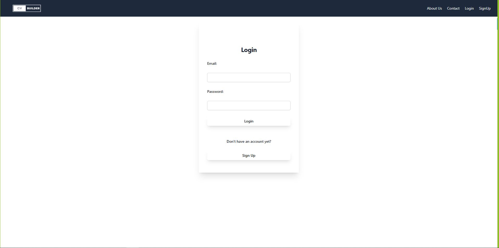
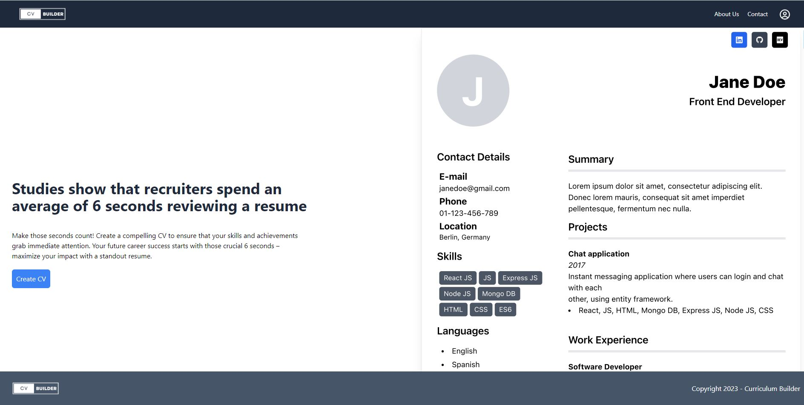
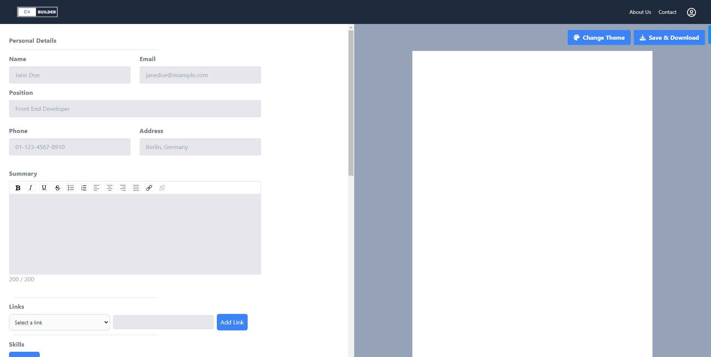
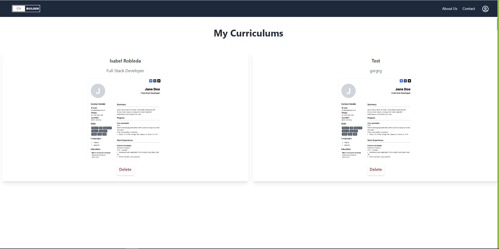
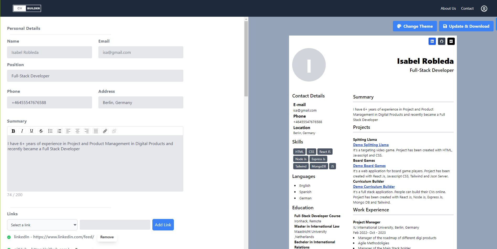
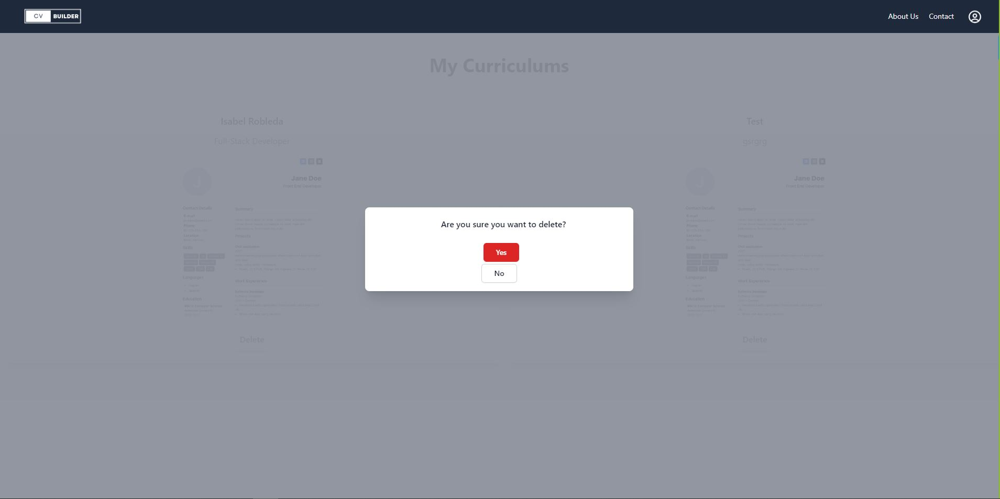

# Curriculum Builder

## Description

- The Curriculum Builder is used for Create and Download Your Curriculum with Ease! 
- Application allows users to generate and save their curriculums quickly and efficiently.
- The Project is built with React Js, Node Js, Express Js and Mongo DB. We have utilized tailwind CSS dependency for styling.

## Features

- Users can create a signup/login to their account.
- They can create their CV online with preview information for better user experience.
- Users can download their CVs and receive a confirmation email as well.
- Users can create multiple CVs in their account.
- They can also delete and update their CVs.

## Instructions to run this app in my computer

- how to install dependencies (`npm install`)
- how to run the application (eg. `npm run dev`)

## Backend Repository Link
[Repository Link](https://github.com/CurriculumBuilder/curriculum-builder-backend)

## Demo

[Project Demo](https://curriculum-builder.netlify.app/)

## Screenshots

### Login Page

### Home Page

### Create CV Page

### MyCurriculums Page

### UpdateCV Page

### Delete CV

